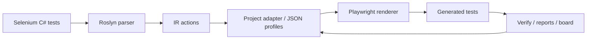

# Selenium → Playwright AST Migrator

**Move large Selenium C# / NUnit suites to Playwright without turning the migration into a hand-written rewrite project.**

This repository contains a .NET 8 CLI migration toolkit that parses Selenium C# tests with Roslyn, builds an intermediate representation, applies project-specific profile mappings, and generates Playwright tests. The main target is **Playwright .NET**; an experimental **Playwright TypeScript** target is available when you already have a real TS Playwright project to plug into.

This archive is prepared for **Autopilot Loop** testing: the old human-checkpoint agent workflow was removed to avoid conflicting instructions.

## Why teams use it

Migrating E2E suites usually fails for boring reasons: thousands of repeated locators, custom PageObjects, fragile waits, and hidden business synchronization. This tool turns that chaos into a measurable workflow:

- **Analyze** Selenium tests and identify repeated migration patterns.
- **Map** PageObject expressions to Playwright locators through reviewable JSON profiles.
- **Generate** compile-ready Playwright scaffolding with smart TODO comments for unsafe areas.
- **Verify** generated .NET or TypeScript code inside real projects.
- **Prioritize** next fixes with reports, smoke plans, runtime failure classification, and migration boards.
- **Iterate through Autopilot Loop**: test, fix, verify, and continue until a real stop condition is reached.

The goal is not magic conversion. The goal is to replace manual rewriting with a controlled migration loop: **source truth → profile/config → generated code → verification → next pattern**.

## Autopilot quick start

Give your coding agent this prompt from the repository root:

```text
Read all files in .agent-loops/.
Also read AGENTS.md and docs/autopilot-loop.md.

Start Migrator Autopilot Loop.

You are allowed and expected to make engineering decisions yourself.
Do not ask me to choose between implementation options.
Do not stop after partial progress.
Continue until the selected migration block is fixed and verified, or until the stop policy requires a real stop.

Current task:
<PASTE CURRENT BLOCK / ERROR / LOG / TODO CATEGORY HERE>

Use repository code, existing tests, snapshots, docs, CLI reports, and command output as the source of truth.
```

Core loop docs:

- [`.agent-loops/README.md`](.agent-loops/README.md)
- [`docs/autopilot-loop.md`](docs/autopilot-loop.md)
- [`AGENTS.md`](AGENTS.md)

## Supported targets

| Source | Target | Status | Notes |
|---|---|---|---|
| Selenium C# / NUnit | Playwright .NET | Primary | Full CLI workflow: analyze, migrate, verify, orchestrate, reports. |
| Selenium C# / NUnit | Playwright TypeScript | Experimental | Requires `--ts-project` pointing to an existing Playwright TS project. No standalone TS generation in vacuum. |

## Core workflow



## CLI quick start

```bash
dotnet restore

dotnet run --project Migrator.Cli -- \
  --mode orchestrate \
  --input ./SeleniumTests \
  --config ./adapter-config.json \
  --out orchestration-1 \
  --format both
```

Outputs are written under `migration/` by default, for example:

```text
migration/orchestration-1/
  generated/
  report.md / report.json
  explain-todo.md / explain-todo.json
  migration-board.html
  smoke-plan.md
```

## Main CLI modes

| Mode | Purpose |
|---|---|
| `doctor` | Preflight checks: input, config, project files, tooling, source truth hints. |
| `analyze` | Parse Selenium files and produce migration reports without generating final code. |
| `migrate` | Generate Playwright .NET or TS tests. |
| `verify` | Lightweight generated-code verification. |
| `verify-project` | Compile generated Playwright .NET tests against a real project/harness. |
| `verify-ts-project` | Type-check generated Playwright TS tests inside an existing TS project. |
| `orchestrate` | Run analyze → migrate → verify → reports for Playwright .NET. |
| `index-pom` | Mine Selenium PageObjects and helper selectors. |
| `profile-match` | Estimate whether existing profiles can be reused for a new project. |
| `config-validate` | Validate profile safety and common mistakes. |
| `config-diff` | Review config changes. |
| `guard` | Compare before/after migration metrics and catch regressions. |
| `explain-todo` | Turn TODO markers into prioritized root-cause insights. |
| `smoke-plan` | Rank generated tests by runtime readiness. |
| `runtime-classify` | Classify Playwright runtime failures after smoke runs. |
| `migration-board` | Generate an HTML dashboard from migration artifacts. |
| `config-schema` | Export JSON Schema for adapter config. |

## Important safety rules

- Never invent selectors.
- Never promote Selenium PageObject variables (`page`, `pagef`, `modal`, `lightbox`, `WebDriver`) to target-known identifiers unless they really exist in target code.
- Do not edit generated `.cs` as the final solution; fix source truth/profile mappings or migrator logic instead.
- Treat `SOURCE_ONLY_IDENTIFIER(page)` as a symptom. Group TODO by full source expression and pattern, not by root variable.
- Elide Selenium actionability waits, but preserve product-state waits such as loader/table/modal synchronization.
- Prefer Roslyn semantic model over text/regex parsing.
- Generated Playwright code should compile whenever possible.

## Development

```bash
dotnet restore
dotnet test --no-restore
```

The test suite covers parser behavior, adapter mappings, snapshots, compile-smoke checks, orchestration, TS target basics, safety guards, and regression cases for common migration blockers.

## Packaging as a dotnet tool

```bash
./scripts/pack-tool.sh
```

See [`docs/packaging-and-distribution.md`](docs/packaging-and-distribution.md) and [`docs/tool-installation.md`](docs/tool-installation.md).

## Philosophy

The best migration is not the one that hides uncertainty. It is the one that makes uncertainty reviewable.

In Autopilot mode, the agent is not allowed to declare victory by words alone. It must use build/test/verify/report feedback and continue until the selected block is actually done or genuinely blocked.
