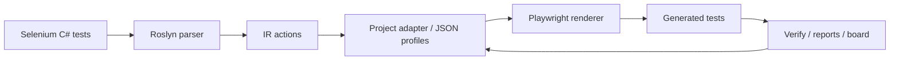

# Selenium → Playwright AST Migrator

**Move large Selenium C# / NUnit suites to Playwright without turning the migration into a hand-written rewrite project.**

This repository contains a .NET 8 CLI migration toolkit that parses Selenium C# tests with Roslyn, builds an intermediate representation, applies project-specific profile mappings, and generates Playwright tests. The main target is **Playwright .NET**; an experimental **Playwright TypeScript** target is available when you already have a real TS Playwright project to plug into.

The tool is intentionally conservative: it generates useful code, reports every uncertain decision, and keeps selectors evidence-based. It is designed for developers and AI agents working together: the migrator does the repetitive AST work, agents mine patterns and improve config, and humans review source-truth decisions.

## Why teams use it

Migrating E2E suites usually fails for boring reasons: thousands of repeated locators, custom PageObjects, fragile waits, and hidden business synchronization. This tool turns that chaos into a measurable workflow:

- **Analyze** Selenium tests and identify repeated migration patterns.
- **Map** PageObject expressions to Playwright locators through reviewable JSON profiles.
- **Generate** compile-ready Playwright scaffolding with smart TODO comments for unsafe areas.
- **Verify** generated .NET or TypeScript code inside real projects.
- **Prioritize** next fixes with dashboards, smoke plans, runtime failure classification, and guard reports.
- **Iterate safely** with strict/creative agent modes and config-only safety loops.

The goal is not magic conversion. The goal is to replace weeks of manual rewriting with a controlled migration loop: **source truth → profile config → generated code → verification → next pattern**.

## Real migration result

On one real complex Selenium C# project:

- Initial TODO count: ~730
- Tracked final-stage TODO, run-44
- After validated core fixes + config refinements: 0
- Syntax errors: 0
- Build diagnostics: 0 before verify-project timeout

The goal was not one-click magic, but an iterative migration workflow:
analyze → mine patterns → update config → verify → patch only real migrator limitations.

## Supported targets

| Source | Target | Status | Notes |
|---|---|---|---|
| Selenium C# / NUnit | Playwright .NET | Primary | Full CLI workflow: analyze, migrate, verify, orchestrate, reports. |
| Selenium C# / NUnit | Playwright TypeScript | Experimental | Requires `--ts-project` pointing to an existing Playwright TS project. No standalone TS generation in vacuum. |

## Core workflow



## Quick start

```bash
dotnet restore

dotnet run --project Migrator.Cli -- \
  --mode orchestrate \
  --input ./SeleniumTests \
  --config ./adapter-config.json \
  --out orchestration-1 \
  --format both
```

Outputs are written under `migration/` by default, for example:

```text
migration/orchestration-1/
  generated/
  report.md / report.json
  explain-todo.md / explain-todo.json
  migration-board.html
  smoke-plan.md
  agent-next-task.md
```

## Agent modes

The project includes two recommended operating modes for AI-assisted migration.

| Mode | Use when | Allowed behavior |
|---|---|---|
| **Strict Mode** | Finalizing, reviewing, preparing MR, avoiding risk | Config-only changes, small verified steps, no creative rewriting. |
| **Creative Mode** | Mining patterns, exploring TS migration, finding blockers | Hypothesize, run safe experiments, create tickets, but never invent selectors. |

Both modes require source truth for selectors. A PageObject property name is not a selector. Agents must inspect POM properties/helpers such as `CreateControlByTid(...)` and `WithDataTestId(...)` before generating locators.

See:

- [`examples/agent-first/start-strict.md`](examples/agent-first/start-strict.md)
- [`examples/agent-first/start-creative.md`](examples/agent-first/start-creative.md)
- [`docs/agent-modes.md`](docs/agent-modes.md)

## TypeScript target

Use TS generation only with an existing Playwright TS project:

```bash
dotnet run --project Migrator.Cli -- \
  --mode migrate \
  --target ts \
  --ts-project ./frontend \
  --input ./SeleniumTests \
  --config ./profiles/base.adapter.json \
  --config ./profiles/project-ts.adapter.json \
  --out ts-migration-1
```

Then verify generated `.spec.ts` files in the real project context:

```bash
dotnet run --project Migrator.Cli -- \
  --mode verify-ts-project \
  --input migration/ts-migration-1 \
  --ts-project ./frontend \
  --out ts-verify-1
```

## Important safety rules

- Never invent selectors.
- Never promote Selenium PageObject variables (`page`, `pagef`, `modal`, `lightbox`, `WebDriver`) to target-known identifiers unless they really exist in target code.
- Do not edit generated `.cs` as the final solution; fix source truth/profile mappings instead.
- Treat `SOURCE_ONLY_IDENTIFIER(page)` as a symptom. Group TODO by full source expression and pattern, not by root variable.
- Elide Selenium actionability waits, but preserve product-state waits such as loader/table/modal synchronization.

## Main CLI modes

| Mode | Purpose |
|---|---|
| `doctor` | Preflight checks: input, config, project files, tooling, source truth hints. |
| `analyze` | Parse Selenium files and produce migration reports without generating final code. |
| `migrate` | Generate Playwright .NET or TS tests. |
| `verify` | Lightweight generated-code verification. |
| `verify-project` | Compile generated Playwright .NET tests against a real project/harness. |
| `verify-ts-project` | Type-check generated Playwright TS tests inside an existing TS project. |
| `orchestrate` | Run analyze → migrate → verify → reports for Playwright .NET. |
| `index-pom` | Mine Selenium PageObjects and helper selectors. |
| `profile-match` | Estimate whether existing profiles can be reused for a new project. |
| `config-validate` | Validate profile safety and common mistakes. |
| `config-diff` | Review config changes. |
| `guard` | Compare before/after migration metrics and catch regressions. |
| `explain-todo` | Turn TODO markers into prioritized root-cause insights. |
| `smoke-plan` | Rank generated tests by runtime readiness. |
| `runtime-classify` | Classify Playwright runtime failures after smoke runs. |
| `migration-board` | Generate an HTML dashboard from migration artifacts. |
| `config-schema` | Export JSON Schema for adapter config. |

## Documentation map

- [`docs/architecture.md`](docs/architecture.md) — architecture and module responsibilities.
- [`docs/agent-modes.md`](docs/agent-modes.md) — Strict vs Creative mode and prompt inputs.
- [`docs/agent-tool-boundary.md`](docs/agent-tool-boundary.md) — using the migrator as a compiled CLI bundle for agents.
- [`docs/migration-safety-playbook.md`](docs/migration-safety-playbook.md) — safety rules for WebDriver, URLs, broad suppressions, waits and assertions.
- [`docs/typescript-target.md`](docs/typescript-target.md) — experimental TypeScript target.
- [`docs/wait-policy.md`](docs/wait-policy.md) — Selenium wait classification.
- [`docs/explain-todo.md`](docs/explain-todo.md) — smart TODO markers and next actions.
- [`docs/migration-board.md`](docs/migration-board.md) — HTML migration dashboard.
- [`docs/project-verification.md`](docs/project-verification.md) — compile verification against real projects.
- [`docs/runtime-readiness.md`](docs/runtime-readiness.md) — smoke candidate scoring.
- [`docs/runtime-failure-classifier.md`](docs/runtime-failure-classifier.md) — runtime failure categories.
- [`docs/json-schema.md`](docs/json-schema.md) — adapter JSON Schema.
- [`docs/agent-playbooks/README.md`](docs/agent-playbooks/README.md) — practical agent playbooks.

## Development

```bash
dotnet restore
dotnet test --no-restore
```

The test suite covers parser behavior, adapter mappings, snapshots, compile-smoke checks, orchestration, TS target basics, safety guards, and regression cases for common migration blockers.

## Packaging as a dotnet tool

```bash
./scripts/pack-tool.sh
```

See [`docs/packaging-and-distribution.md`](docs/packaging-and-distribution.md) and [`docs/tool-installation.md`](docs/tool-installation.md).

## Agent CLI bundle

For AI-agent migrations, prefer giving the agent a compiled CLI bundle instead of the migrator source repository:

```powershell
.\scripts\package-agent-cli-bundle.ps1 -Runtime win-x64 -Output artifacts/agent-cli-bundle
```

Then copy `artifacts/agent-cli-bundle/tool` to the target project, for example:

```text
<target-playwright-project>/tools/migrator
```

The bundle contains `migrator.exe`, schema and agent-facing docs, but no C# source code. See [`docs/agent-tool-boundary.md`](docs/agent-tool-boundary.md).

## Philosophy

The best migration is not the one that hides uncertainty. It is the one that makes uncertainty reviewable.

This tool optimizes for:

- transparent source-truth decisions;
- small reversible config changes;
- measurable progress;
- compile/runtime feedback;
- AI-agent productivity without unsafe hallucinated selectors.
