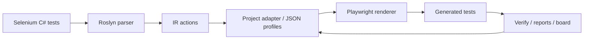

# Selenium → Playwright AST Migrator

**Переносите большие Selenium C# / NUnit-наборы в Playwright без превращения миграции в полностью ручное переписывание.**

Этот репозиторий содержит CLI-инструментарий миграции на .NET 8. Он парсит Selenium C# тесты через Roslyn, строит промежуточное представление, применяет проектные profile mappings и генерирует Playwright-тесты. Основная цель — **Playwright .NET**. Экспериментальная цель **Playwright TypeScript** доступна, если у вас уже есть реальный Playwright TS-проект, в который можно встроить сгенерированные тесты.

Инструмент намеренно консервативен: он генерирует полезный код, сообщает о каждом неоднозначном решении и опирается только на подтверждённые selector evidence. Он рассчитан на совместную работу разработчиков и AI-агентов: мигратор берёт на себя повторяющуюся AST-рутину, агенты находят паттерны и улучшают config, а люди ревьюят решения, где нужен source truth.

## Зачем команды используют этот инструмент

Миграция E2E-наборов обычно ломается по скучным причинам: тысячи повторяющихся локаторов, custom PageObjects, хрупкие wait-ы и скрытая бизнес-синхронизация. Этот инструмент превращает хаос в измеримый workflow:

* **Analyze** — анализирует Selenium-тесты и находит повторяющиеся паттерны миграции.
* **Map** — связывает PageObject expressions с Playwright locators через ревьюируемые JSON-профили.
* **Generate** — генерирует compile-ready Playwright scaffold с умными TODO-комментариями для небезопасных мест.
* **Verify** — проверяет сгенерированный .NET или TypeScript-код внутри реальных проектов.
* **Prioritize** — помогает выбрать следующие исправления через dashboards, smoke plans, runtime failure classification и guard reports.
* **Iterate safely** — поддерживает strict/creative режимы агентов и config-only safety loops.

Цель — не магическая конвертация. Цель — заменить недели ручного переписывания контролируемым миграционным циклом: **source truth → profile config → generated code → verification → next pattern**.

## Реальный кейс миграции 1

На одном реальном сложном Selenium C# проекте:

* Изначальное количество TODO: ~730
* Отслеживаемый финальный этап TODO, run-44
* После проверенных core fixes и config refinements: 0
* Syntax errors: 0
* Build diagnostics: 0 до timeout в verify-project

Целью была не one-click magic, а итерационный migration workflow:

```text
analyze → mine patterns → update config → verify → patch only real migrator limitations
```

## Реальный кейс миграции 2

Мигратор также был проверен на более крупном Selenium C# E2E-наборе.

| Метрика                       | Начальный run | Финальный run |
| ----------------------------- | ------------: | ------------: |
| Active TODO                   |          2244 |            63 |
| Компилируемые generated files |          0/89 |         89/89 |
| C# compile errors             |           89+ |             0 |

Финальный результат снизил количество active TODO примерно на 97% и дал сгенерированный Playwright .NET-код, который успешно компилировался во всех 89 generated files.

Оставшиеся 63 TODO были намеренно оставлены как точки ручной миграции. В основном они относятся к местам, где автоматическая миграция не должна угадывать поведение:

* URL assertions;
* отдельные свойства legacy PageObject;
* custom project-specific helpers;
* source-only architecture gaps.

Это считается успешным этапом миграции: проект компилируется, основная масса повторяющихся Selenium-паттернов была мигрирована или безопасно классифицирована, а оставшаяся работа — это ревьюируемая ручная адаптация тестов, а не failure parser-а или renderer-а.

## Поддерживаемые цели

| Source              | Target                | Статус            | Примечания                                                                                                                        |
| ------------------- | --------------------- | ----------------- | --------------------------------------------------------------------------------------------------------------------------------- |
| Selenium C# / NUnit | Playwright .NET       | Основная          | Полный CLI workflow: analyze, migrate, verify, orchestrate, reports.                                                              |
| Selenium C# / NUnit | Playwright TypeScript | Экспериментальная | Требует `--ts-project`, указывающий на существующий Playwright TS-проект. Standalone TS generation “в вакууме” не поддерживается. |

## Основной workflow



## Быстрый старт

```bash
dotnet restore

dotnet run --project Migrator.Cli -- \
  --mode orchestrate \
  --input ./SeleniumTests \
  --config ./adapter-config.json \
  --out orchestration-1 \
  --format both
```

По умолчанию output записывается в `migration/`, например:

```text
migration/orchestration-1/
  generated/
  report.md / report.json
  explain-todo.md / explain-todo.json
  migration-board.html
  smoke-plan.md
  agent-next-task.md
```

## Режимы агентов

Проект включает два рекомендуемых режима для AI-assisted migration.

| Режим             | Когда использовать                                         | Разрешённое поведение                                                                                            |
| ----------------- | ---------------------------------------------------------- | ---------------------------------------------------------------------------------------------------------------- |
| **Strict Mode**   | Финализация, ревью, подготовка MR, снижение риска          | Config-only изменения, маленькие проверенные шаги, без creative rewriting.                                       |
| **Creative Mode** | Поиск паттернов, исследование TS migration, поиск blockers | Формулировать гипотезы, запускать безопасные эксперименты, создавать тикеты, но никогда не выдумывать selectors. |

Оба режима требуют source truth для selectors. Имя PageObject property — это не selector. Агенты должны изучать POM properties/helpers вроде `CreateControlByTid(...)` и `WithDataTestId(...)` перед генерацией locators.

См.:

* [`examples/agent-first/start-strict.md`](examples/agent-first/start-strict.md)
* [`examples/agent-first/start-creative.md`](examples/agent-first/start-creative.md)
* [`docs/agent-modes.md`](docs/agent-modes.md)

## TypeScript target

Используйте TS generation только с существующим Playwright TS-проектом:

```bash
dotnet run --project Migrator.Cli -- \
  --mode migrate \
  --target ts \
  --ts-project ./frontend \
  --input ./SeleniumTests \
  --config ./profiles/base.adapter.json \
  --config ./profiles/project-ts.adapter.json \
  --out ts-migration-1
```

Затем проверьте сгенерированные `.spec.ts` файлы в контексте реального проекта:

```bash
dotnet run --project Migrator.Cli -- \
  --mode verify-ts-project \
  --input migration/ts-migration-1 \
  --ts-project ./frontend \
  --out ts-verify-1
```

## Важные правила безопасности

* Никогда не выдумывайте selectors.
* Никогда не переводите Selenium PageObject variables (`page`, `pagef`, `modal`, `lightbox`, `WebDriver`) в target-known identifiers, если они реально не существуют в target-коде.
* Не редактируйте generated `.cs` как финальное решение; исправляйте source truth/profile mappings.
* Относитесь к `SOURCE_ONLY_IDENTIFIER(page)` как к симптому. Группируйте TODO по полному source expression и pattern, а не только по root variable.
* Удаляйте Selenium actionability waits, но сохраняйте product-state waits, например синхронизацию loader/table/modal.

## Основные CLI modes

| Mode                | Назначение                                                                       |
| ------------------- | -------------------------------------------------------------------------------- |
| `doctor`            | Preflight checks: input, config, project files, tooling, source truth hints.     |
| `analyze`           | Парсит Selenium-файлы и создаёт migration reports без генерации финального кода. |
| `migrate`           | Генерирует Playwright .NET или TS тесты.                                         |
| `verify`            | Лёгкая проверка generated code.                                                  |
| `verify-project`    | Компилирует generated Playwright .NET тесты против реального project/harness.    |
| `verify-ts-project` | Проверяет типы generated Playwright TS тестов внутри существующего TS-проекта.   |
| `orchestrate`       | Запускает analyze → migrate → verify → reports для Playwright .NET.              |
| `index-pom`         | Анализирует Selenium PageObjects и helper selectors.                             |
| `profile-match`     | Оценивает, можно ли переиспользовать существующие profiles для нового проекта.   |
| `config-validate`   | Валидирует profile safety и типичные ошибки.                                     |
| `config-diff`       | Помогает ревьюить изменения config.                                              |
| `guard`             | Сравнивает before/after migration metrics и ловит regressions.                   |
| `explain-todo`      | Превращает TODO markers в приоритизированные root-cause insights.                |
| `smoke-plan`        | Ранжирует generated tests по runtime readiness.                                  |
| `runtime-classify`  | Классифицирует Playwright runtime failures после smoke runs.                     |
| `migration-board`   | Генерирует HTML dashboard из migration artifacts.                                |
| `config-schema`     | Экспортирует JSON Schema для adapter config.                                     |

## Карта документации

* [`docs/architecture.md`](docs/architecture.md) — архитектура и ответственность модулей.
* [`docs/agent-modes.md`](docs/agent-modes.md) — Strict vs Creative mode и prompt inputs.
* [`docs/agent-tool-boundary.md`](docs/agent-tool-boundary.md) — использование мигратора как compiled CLI bundle для агентов.
* [`docs/migration-safety-playbook.md`](docs/migration-safety-playbook.md) — правила безопасности для WebDriver, URLs, broad suppressions, waits и assertions.
* [`docs/typescript-target.md`](docs/typescript-target.md) — экспериментальный TypeScript target.
* [`docs/wait-policy.md`](docs/wait-policy.md) — классификация Selenium wait-ов.
* [`docs/explain-todo.md`](docs/explain-todo.md) — smart TODO markers и next actions.
* [`docs/migration-board.md`](docs/migration-board.md) — HTML migration dashboard.
* [`docs/project-verification.md`](docs/project-verification.md) — compile verification против реальных проектов.
* [`docs/runtime-readiness.md`](docs/runtime-readiness.md) — smoke candidate scoring.
* [`docs/runtime-failure-classifier.md`](docs/runtime-failure-classifier.md) — категории runtime failures.
* [`docs/json-schema.md`](docs/json-schema.md) — adapter JSON Schema.
* [`docs/agent-playbooks/README.md`](docs/agent-playbooks/README.md) — практические agent playbooks.

## Разработка

```bash
dotnet restore
dotnet test --no-restore
```

Тестовый набор покрывает parser behavior, adapter mappings, snapshots, compile-smoke checks, orchestration, основы TS target, safety guards и regression cases для частых migration blockers.

## Упаковка как dotnet tool

```bash
./scripts/pack-tool.sh
```

См. [`docs/packaging-and-distribution.md`](docs/packaging-and-distribution.md) и [`docs/tool-installation.md`](docs/tool-installation.md).

## Agent CLI bundle

Для AI-agent migrations лучше давать агенту compiled CLI bundle вместо исходного репозитория мигратора:

```powershell
.\scripts\package-agent-cli-bundle.ps1 -Runtime win-x64 -Output artifacts/agent-cli-bundle
```

Затем скопируйте `artifacts/agent-cli-bundle/tool` в target project, например:

```text
<target-playwright-project>/tools/migrator
```

Bundle содержит `migrator.exe`, schema и agent-facing docs, но не содержит C# source code. См. [`docs/agent-tool-boundary.md`](docs/agent-tool-boundary.md).

## Философия

Лучшая миграция — не та, которая скрывает неопределённость. Лучшая миграция — та, которая делает неопределённость ревьюируемой.

Этот инструмент оптимизирован под:

* прозрачные source-truth decisions;
* маленькие обратимые config changes;
* измеримый прогресс;
* compile/runtime feedback;
* продуктивность AI-агентов без небезопасно выдуманных selectors.
