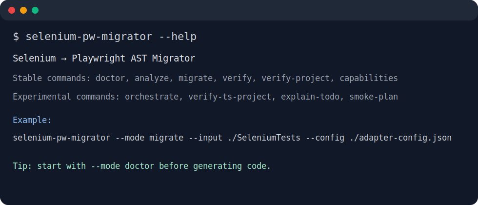
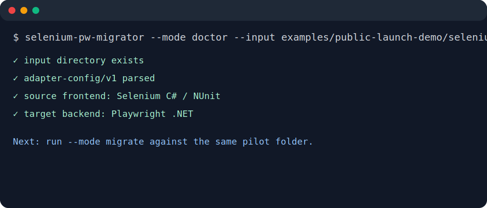
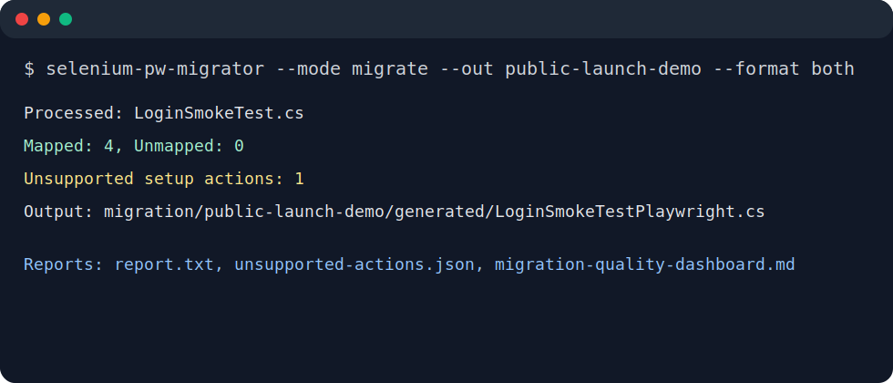
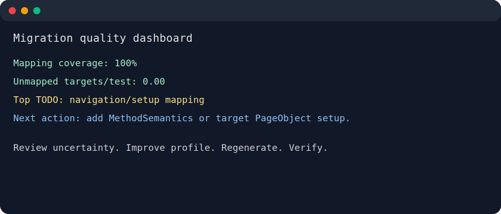

# Screenshot walkthrough

This walkthrough is intentionally short and screenshot-like. It shows the happy path a new user should follow with the demo project.

## 1. Install or run the tool



```bash
dotnet tool install --global SeleniumPlaywrightMigrator --prerelease
selenium-pw-migrator --help
```

For local development from source, use `dotnet run --project Migrator.Cli -- --help`.

## 2. Run doctor on the demo input



```bash
selenium-pw-migrator --mode doctor \
  --input examples/public-launch-demo/selenium-tests \
  --config examples/public-launch-demo/adapter-config.json \
  --out public-demo-doctor
```

`doctor` should be the first command in public demos because it catches missing inputs, invalid config, and workspace mistakes before generation.

## 3. Migrate a small pilot



```bash
selenium-pw-migrator --mode migrate \
  --input examples/public-launch-demo/selenium-tests \
  --config examples/public-launch-demo/adapter-config.json \
  --out public-demo \
  --format both
```

The output should be inspected, not blindly committed. The useful files are generated Playwright tests, `report.txt`, `unmapped-targets.*`, `unsupported-actions.*`, and `migration-quality-dashboard.*`.

## 4. Verify and inspect the report



```bash
selenium-pw-migrator --mode verify \
  --input examples/public-launch-demo/selenium-tests \
  --config examples/public-launch-demo/adapter-config.json \
  --out public-demo-verify \
  --format both
```

Then open the generated report and compare it with the copy-ready example:

- [Before/after report example](../../examples/public-launch-demo/reports/before-after-report.md)
- [Expected migrated output](../../examples/public-launch-demo/playwright-migrated/LoginSmokePlaywright.generated.cs)

## 5. Iterate safely

For real projects, do not fix repeated TODOs by editing generated code. Improve selector evidence, adapter config, method semantics, or target POM mappings, then regenerate.
